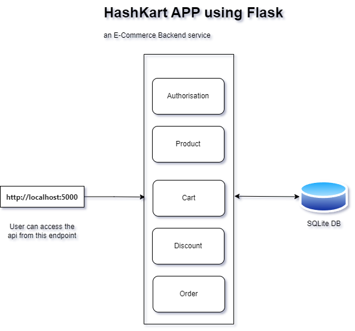
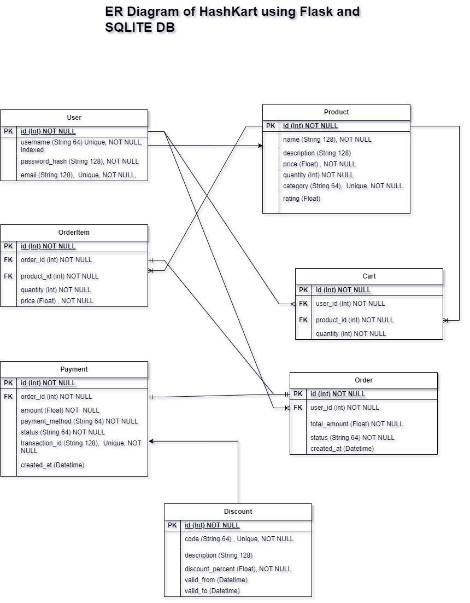

# HashKart !
## -an ecommerce shopping backend service

## API Endpoint
Base URL: `http://localhost:5000`

## Architecture


## Entity Relationship Diagram


## Use Cases and Functionalities

### User Authentication
1. **Sign Up**
   - **Endpoint**: `/auth/signup`
   - **Method**: POST
   - **Sample Request**:
     ```json
     {
       "username": "testuser",
       "email": "test@example.com",
       "password": "password123"
     }
     ```
2. **Login**
   - **Endpoint**: `/auth/login`
   - **Method**: POST
   - **Sample Request**:
     ```json
     {
       "username": "testuser",
       "password": "password123"
     }
     ```
3. **Profile**
   - **Endpoint**: `/auth/profile`
   - **Method**: GET
   - **Headers**:
     ```
     Authorization: Bearer <JWT_TOKEN>
     ```

### Product Management
1. **Get All Products**
   - **Endpoint**: `/products`
   - **Method**: GET
2. **Get Product by ID**
   - **Endpoint**: `/products/<product_id>`
   - **Method**: GET
3. **Create Product**
   - **Endpoint**: `/products`
   - **Method**: POST
   - **Sample Request**:
     ```json
     {
       "name": "New Product",
       "description": "Product Description",
       "price": 29.99,
       "stock": 100,
       "quantity": 2,
       "category": "Cat A",
       "rating": 4.5
     }
     ```
5. **Delete Product**
   - **Endpoint**: `/products/<product_id>`
   - **Method**: DELETE

### Cart Management
1. **Get Cart**
   - **Endpoint**: `/cart`
   - **Method**: GET
2. **Add to Cart**
   - **Endpoint**: `/cart`
   - **Method**: POST
   - **Sample Request**:
     ```json
     {
       "product_id": 1,
       "quantity": 2
     }
     ```
3. **Update Cart Item**
   - **Endpoint**: `/cart/<item_id>`
   - **Method**: PUT
   - **Sample Request**:
     ```json
     {
       "quantity": 3
     }
     ```
4. **Remove from Cart**
   - **Endpoint**: `/cart/<item_id>`
   - **Method**: DELETE

### Discount Management
1. **Get All Discounts**
   - **Endpoint**: `/discounts`
   - **Method**: GET
2. **Apply Discount**
   - **Endpoint**: `/discounts/apply`
   - **Method**: POST
   - **Sample Request**:
     ```json
     {
       "code": "DISCOUNT2024"
     }
     ```
3. **Add Discount**
   - **Endpoint**: `/discounts/add`
   - **Method**: POST
   - **Sample Request**:
     ```json
     {
        "code": "SUMMER2024",
        "description": "Summer Sale! Enjoy exclusive deals",
        "discount_percent": 15,  "valid_from": "01-06-2024",
        "valid_to": "30-06-2024"
     }
     ```

### Order Management

1. **Create Order**
   - **Endpoint:** `/orders`
   - **Method:** `POST`
   - **Headers:**
     ```json
     {
       "Authorization": "Bearer <JWT_TOKEN>"
     }
     ```
   - **Description:** Creates an order from the items in the user's cart.


2. **Process Payment**
   - **Endpoint:** `/orders/payment`
   - **Method:** `POST`
   - **Headers:**
     ```json
     {
       "Authorization": "Bearer <JWT_TOKEN>"
     }
     ```
   - **Request Body:**
     ```json
     {
       "order_id": 1,
       "payment_method": "Credit Card"
     }
     ```
   - **Description:** Processes the payment for the specified order.

## Setup and Run the Application
1. `python3 -m venv venv` (python3.9 for this case)
2. `source venv/bin/activate` (Linux/Mac) or `venv\Scripts\Activate.ps1` (Windows)
3. `pip install -r requirements.txt`
5. `flask db init`
6. `flask db migrate`
7. `flask db upgrade`
8. `flask run`
